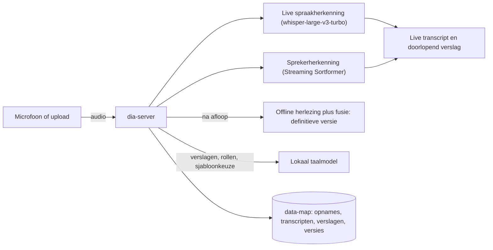

# dia — Nederlandse gespreksverslaglegging, volledig lokaal

**dia** neemt gesprekken op, transcribeert ze live met sprekerherkenning en maakt er
automatisch een professioneel gespreksverslag van — **volledig lokaal**, zonder dat één
woord het eigen apparaat verlaat. Gebouwd voor de juridische praktijk (letselschade),
bruikbaar voor elke situatie waarin vertrouwelijke gesprekken verslaglegging nodig hebben.

---

## Inhoud

1. [Wat het doet en kan](#wat-het-doet-en-kan)
2. [Hoe het werkt](#hoe-het-werkt)
3. [Systeemvereisten](#systeemvereisten)
4. [Installatie](#installatie) — drie routes: script, Docker, handmatig
5. [Het taalmodel voor verslagen opzetten](#het-taalmodel-voor-verslagen-opzetten)
6. [Configuratie](#configuratie)
7. [Voorbeeld: van opname tot verslag](#voorbeeld-van-opname-tot-verslag)
8. [Veelgestelde vragen en problemen](#veelgestelde-vragen-en-problemen)
9. [Licenties, modellen en wat niet in de repo zit](#licenties-modellen-en-wat-niet-in-de-repo-zit)
10. [Documentatiekaart](#documentatiekaart)

---

## Wat het doet en kan

**Gesprek opnemen (de kern).** Eén knop start een opname die op de **server** draait:
valt de wifi weg, klapt de laptop dicht of crasht de browser — de opname loopt door en de
microfoon koppelt vanzelf opnieuw aan. Tijdens het gesprek zie je live het transcript met
sprekerlabels en een doorlopend bijgewerkt gespreksverslag. Een verbindingsbewaker toont
het eerlijk als het netwerk hapert ("verbinding traag · 5s achter") en schakelt bij
aanhoudende traagheid automatisch naar een spaarzame audiokwaliteit (12 i.p.v. 32 kbit/s —
de herkenning merkt daar nauwelijks iets van).

**Definitieve versie, automatisch.** Na het stoppen maakt de server op de achtergrond een
tweede, betere versie: het beste offline-model herleest de complete audio en het resultaat
wordt gefuseerd met de live-sprekerindeling (deze fusiemethode won onze eigen metingen van
alle alternatieven). In het Archief verschijnt "definitieve versie wordt gemaakt… (enkele
minuten)" en daarna staan transcript, verslag en audio klaar als download.

**Gespreksverslagen via sjablonen.** Een verslag volgt een sjabloon: standaard meegeleverd
zijn *Letselschade-intakegesprek* (toedracht, aansprakelijkheid, letsel en klachten,
behandelingen, pre-existente klachten, werk en inkomen, beperkingen, schadeposten,
verzekeringen, vervolgstappen), *Regelingsgesprek met de tegenpartij* (schadeposten en
standpunten, voorschotten en slotbetaling, finale kwijting, voorbehouden en heropening,
belastinggarantie, buitengerechtelijke kosten, vaststellingsovereenkomst) en *Algemeen
gespreksverslag*. Sjablonen zijn vrij te bewerken en uit te breiden onder Instellingen.
Per gesprek kies je de verslagvorm bij de start, of je laat het taalmodel na afloop zelf
het meest passende sjabloon kiezen (terugval: algemeen). Achteraf wijzigen kan altijd —
het verslag wordt dan opnieuw gegenereerd uit het transcript.

**Sprekerrollen.** Het taalmodel stelt per spreker een rol voor ("cliënt",
"letselschadejurist", "partner van cliënt" — tot zes sprekers). Jij past aan en bevestigt;
pas daarna gebruiken verslagen de rolnamen, en het transcript toont ze dan ook.

**Versiebeheer van verslagen.** Elke wijziging — automatisch, via een sjabloon of
handmatig bewerkt — wordt een nieuwe versie met tijdstip, bron en een korte omschrijving
van wat er veranderde. Niets wordt ooit overschreven; een eerdere versie terugzetten is
één klik en ook dat is weer omkeerbaar.

**Bestanden verwerken.** Upload een audiobestand (ook m4a van de telefoon; optionele
volumenormalisatie voor zachte opnames) en krijg dezelfde pijplijn: transcript,
sprekerrollen, sjabloonverslag, downloads.

**Privacy.** Alles draait lokaal. Verwijderen is volledig: audio, transcript, rollen en
álle verslagversies worden gewist — aantoonbaar, het zit in de testsuite.

**Meetgedreven.** Elke modelkeuze in dit project is gemeten op eigen conversationele
Nederlandse data, niet op gepubliceerde benchmarks — inclusief woordlatentie van de
live-pijplijn (~1 s mediaan) en een bake-off van alle serieuze open modellen
([docs/COMPARISON.md](docs/COMPARISON.md)).

## Hoe het werkt



De browser is alleen een scherm en een microfoon; al het werk en alle opslag gebeurt op de
server (de eigen machine). Het taalmodel voor verslagen is een **apart lokaal proces**
(zie [hieronder](#het-taalmodel-voor-verslagen-opzetten)) — zonder dat proces blijft
opnemen en transcriberen volledig werken.

## Systeemvereisten

| Wat | Vereist | Opmerking |
|---|---|---|
| Besturingssysteem | Linux | ontwikkeld op DGX OS (Ubuntu-basis) |
| GPU | NVIDIA met CUDA 13-driver | ontwikkeld en gemeten op DGX Spark (GB10, aarch64, 128 GB unified memory); andere CUDA-GPU's met ≥16 GB kunnen werken maar zijn niet getest |
| Python | 3.12 | wordt door de setup zelf in venvs geregeld |
| ffmpeg | ja | audio-decodering (alle formaten, incl. m4a) |
| Schijf | ~10 GB voor modellen | plus ruimte voor eigen opnames |
| Browser | Chrome of Safari, desktop en mobiel | microfoon op afstand vereist HTTPS — de meegeleverde TLS-proxy op :8443 regelt dat |
| Taalmodel-runtime (voor verslagen) | een OpenAI-compatibel endpoint, bijv. vLLM | apart proces; optioneel maar sterk aangeraden |

## Installatie

### Route A — installatiescript (aanbevolen)

```bash
git clone https://github.com/MaartenSmeets/dia.git && cd dia
scripts/setup.sh          # bouwt alle Python-omgevingen, exact gepind (installeert zo nodig uv)
cp .env.example .env      # en vul HF_TOKEN in — zie Configuratie hieronder
scripts/run_app.sh        # → http://localhost:8080 (mobiel: https://<machinenaam>:8443)
```

Wat het script doet: het installeert [uv](https://docs.astral.sh/uv/) als dat ontbreekt,
bouwt `venvs/wlk` (live-motor) en `venvs/eval` (nabewerking/metingen) uit de **bevroren**
dependency-bestanden `requirements/{wlk,eval}.txt` — exact de versies waarmee alles hier
gemeten en getest is, inclusief de verplichte CUDA 13-wheels — en sluit af met een
GPU-zelftest. `scripts/setup.sh --all` bouwt ook de optionele derde omgeving (alleen nodig
voor één benchmarkscript). De eerste start van de app downloadt daarna automatisch de
spraakmodellen (~5 GB, eenmalig); daarna is een herstart in ±30 seconden klaar.

### Route B — Docker

Vereist de [NVIDIA Container Toolkit](https://docs.nvidia.com/datacenter/cloud-native/container-toolkit/latest/install-guide.html).

```bash
git clone https://github.com/MaartenSmeets/dia.git && cd dia
cp .env.example .env      # HF_TOKEN invullen
docker compose up -d --build
```

De compose-definitie geeft de container GPU-toegang en koppelt `./data` en `./models` als
volumes, zodat opnames en modellen buiten de container leven en een rebuild overleven.
Het taalmodel voor verslagen draait bewust **buiten** deze container (eigen
vLLM-container, zie hieronder).

### Route C — handmatig

Stap-voor-stap met alle geverifieerde commando's en platformvalkuilen:
[docs/SETUP.md](docs/SETUP.md).

## Het taalmodel voor verslagen opzetten

Gespreksverslagen, sprekerrollen en sjabloonvoorstellen gebruiken een **lokaal taalmodel**
via een OpenAI-compatibel endpoint. Elk zo'n endpoint werkt; een concreet voorbeeld met
[vLLM](https://docs.vllm.ai) en een Qwen-model (Apache-2.0):

```bash
docker run -d --name vllm --gpus all --ipc=host -p 127.0.0.1:8000:8000 \
  vllm/vllm-openai:latest \
  --model Qwen/Qwen2.5-14B-Instruct-AWQ \
  --served-model-name verslagmodel \
  --gpu-memory-utilization 0.40 --max-model-len 32768
```

Kies een model dat naast de spraakmodellen in het GPU-geheugen past (op een gedeelde GPU:
`--gpu-memory-utilization ≤ 0.40`). Daarna in dia: **Instellingen → "Automatisch
detecteren"** — de app vindt lokale endpoints op de gangbare poorten zelf en kiest het
eerste beschikbare model. Handmatig kan ook (URL + modelnaam invullen, "Test verbinding").
Zonder taalmodel werkt al het overige gewoon; de verslag-knoppen leggen dan uit wat er
mist. Ons eigen, op de GB10 doorgemeten recept staat in [docs/OPS-LLM.md](docs/OPS-LLM.md).

## Configuratie

**1. `.env` — omgevingsvariabelen** (kopieer `.env.example`; wordt nooit gecommit):

| Variabele | Verplicht? | Betekenis |
|---|---|---|
| `HF_TOKEN` | ja (eenmalig) | gratis Hugging Face-token; nodig voor het gated pyannote-model. Accepteer ook eenmalig de voorwaarden op de [modelpagina](https://huggingface.co/pyannote/speaker-diarization-community-1) |
| `SUMMARIZER_URL` / `SUMMARIZER_MODEL` | nee | taalmodel-endpoint; leeg = autodetectie. Ook via de Instellingen-pagina te zetten (persistent) |
| `REFINE_ADAPTER` | nee | pad naar een optionele LoRA-adapter voor de definitieve versie; leeg of niet-bestaand = vrij basismodel |
| `CGN_PCLOUD_CODE` / `CGN_PCLOUD_FILEID` | nee | alleen voor het CGN-downloadscript (persoonlijke leverlink na licentie) |

**2. In de app — Instellingen-tab** (voor de eindgebruiker): taalmodel koppelen/testen en
**verslagsjablonen** beheren (naam, optionele instructie, onderdelen — één per regel).
Wijzigingen zijn direct actief en blijven bewaard.

**3. Expertmodus** (knop "geavanceerd" rechtsboven): engine-instellingen van de
spraakherkenning als JSON (`app/engine_config.json`; model, latentieknoppen,
vakjargon-prompt) met veilige validatie — ongeldige instellingen worden geweigerd en
breken niets — plus de Evaluatie- en Live-testtabs.

**Waar staat wat:** opnames en verslagen in `data/meetings/` en `data/sessions/`
(inclusief `summary_versions.json`, de volledige versiegeschiedenis per gesprek);
sjablonen in `data/templates.json`; modellen in de Hugging Face-cache (`data/hf`).
Back-up van `data/` = back-up van alles.

## Voorbeeld: van opname tot verslag

Een letselschade-intake bij de cliënt thuis, opgenomen met de telefoon:

1. Open **https://\<machinenaam\>:8443** op de telefoon (eenmalig het zelfondertekende
   certificaat accepteren). Tab **Gesprek**: naam "Intake dossier-X", verslagvorm
   "Letselschade-intakegesprek" (of laat op "automatisch" staan), **● Start gesprek**.
2. Voer het gesprek. Het transcript en het doorlopende verslag groeien live mee; valt de
   verbinding even weg, dan meldt de statuspil dat en herstelt hij zichzelf — de opname
   op de server loopt gewoon door.
3. **⏹ Stop & rond af.** Het gesprek verschijnt in het **Archief**; na enkele minuten
   staat daar de **definitieve versie** (beter transcript + verslag volgens het gekozen
   sjabloon).
4. Open het gesprek in het Archief. Klik **👥 Rollen laten voorstellen** → controleer
   ("spk0 = letselschadejurist, spk1 = cliënt"), pas aan waar nodig, **✔ Rollen
   bevestigen**. Klik **📋 Gespreksverslag maken** — het verslag wordt opnieuw gemaakt,
   nu met rolnamen, netjes langs alle intake-onderdelen (toedracht, aansprakelijkheid,
   behandelingen, pre-existente klachten, schadeposten, vervolgafspraken…).
5. Niet helemaal goed? **✏ Bewerken** voor handmatige correcties (nieuwe versie; de oude
   blijft in het versies-menu), of kies een andere verslagvorm en genereer opnieuw.
6. Download onderaan: definitief transcript, definitief gespreksverslag (Markdown) en de
   audio. Klaar voor het dossier.

## Veelgestelde vragen en problemen

- **De microfoon doet het niet vanaf mijn telefoon.** Microfoontoegang buiten localhost
  vereist HTTPS: gebruik `https://<machinenaam>:8443` (een banner op de http-pagina wijst
  de weg) en accepteer eenmalig het certificaat.
- **"Geen taalmodel ingesteld."** Start je LLM-endpoint (zie boven) en klik Instellingen →
  "Automatisch detecteren".
- **De eerste start duurt lang.** Eenmalig: de spraakmodellen (~5 GB) worden gedownload.
  Daarna laadt de engine warm in ±30 seconden; `/health` antwoordt zodra hij klaar is.
- **De definitieve versie blijft uit.** Het Archief toont de status ("wordt gemaakt…" /
  "mislukt — de live-versie blijft beschikbaar"). De live-versie is er altijd al.
- **Werkt het ook zonder GPU?** Nee — de live-herkenning is op GPU-snelheid ontworpen.

## Licenties, modellen en wat niet in de repo zit

Code en documentatie: **MIT**. De applicatie werkt out-of-the-box met uitsluitend vrij
beschikbare modellen:

| Onderdeel | Model | Licentie | Verkrijgen |
|---|---|---|---|
| Live spraakherkenning | `whisper-large-v3-turbo` | MIT | automatisch bij eerste start |
| Live sprekerherkenning | `nvidia/diar_streaming_sortformer_4spk-v2` | CC-BY-4.0 | automatisch, ongated |
| Offline sprekerherkenning | `pyannote/speaker-diarization-community-1` | vrij, gated | HF-account + voorwaarden accepteren + token |
| Verslagen (LLM) | eigen keuze, bijv. Qwen | per model (Qwen: Apache-2.0) | zelf draaien via vLLM e.d. |

**Optioneel, vergt licentie:** een LoRA-adapter getraind op het Corpus Gesproken
Nederlands verbetert de definitieve versie met ~7 WER-punten op spontaan Nederlands
(gemeten). CGN is niet-commercieel gelicenseerd, dus die adapter zit niet in de repo;
zelf trainen kan met de meegeleverde scripts na een (gratis, NC) licentie bij het
Instituut voor de Nederlandse Taal — afwegingskader en recept in
[docs/CGN-VALUE.md](docs/CGN-VALUE.md). Zonder adapter gebruikt de nabewerking automatisch
het vrije basismodel, dat in onze bake-off alle andere open modellen versloeg. Een adapter
op alléén vrije data voegde gemeten niets toe.

**Bewust niet in de repo:** corpora en referenties (CGN NC; IFADV research-only — zie
[docs/DATASETS.md](docs/DATASETS.md)), getrainde adapters, geheimen (`.env`, certificaten)
en ruwe experimentresultaten (conclusies staan in docs/).

## Documentatiekaart

| Doc | Inhoud |
|---|---|
| [docs/PROGRESS.md](docs/PROGRESS.md) | **Startpunt voor wie verder bouwt** (mens of AI): het levende logboek — wat af is, geverifieerd is en volgt. |
| [docs/WEBAPP.md](docs/WEBAPP.md) | Architectuur van de app: API, WebSocket-protocol, vergadermodel, sjablonen/rollen/versiebeheer, verbindingsbewaking, testsuite. |
| [docs/SETUP.md](docs/SETUP.md) | As-built installatie: uitsluitend commando's die hier daadwerkelijk gedraaid en geverifieerd zijn. |
| [docs/COMPARISON.md](docs/COMPARISON.md) | De gemeten methode- en modelvergelijkingen (streaming vs offline, bake-off, fusie, hybride gesprekken). |
| [docs/EVALUATION.md](docs/EVALUATION.md) | Meetmethodiek: WER/cpWER/DER, normalisatie, latentie, hoe je zelf meet. |
| [docs/SUMMARY-EVAL.md](docs/SUMMARY-EVAL.md) | Gemeten: sprekerlabels maken verslagen ×3,5 accurater — plus de meetprotocol-lessen. |
| [docs/CGN-VALUE.md](docs/CGN-VALUE.md) | De CGN-licentiebeslissing: metingen, waardetabel per use-case, trainingsrecept. |
| [docs/DATASETS.md](docs/DATASETS.md) | Alle gebruikte data: herkomst, licenties, downloadinstructies. |
| [docs/RESEARCH.md](docs/RESEARCH.md) + [appendix](docs/RESEARCH-verification-appendix.json) | Het bronnenonderzoek achter elke stackkeuze, met verificatie-oordelen. |
| [docs/OPS-LLM.md](docs/OPS-LLM.md) | Runbook voor het lokale taalmodel (vLLM op GB10): gezondheidscheck, wissel, valkuilen. |
| [docs/PLAN.md](docs/PLAN.md) | Bouwplan met fases en acceptatiecriteria. |
| [CLAUDE.md](CLAUDE.md) | Harde regels en conventies voor (AI-)voortzetting van dit project. |

## Status

Zie [docs/PROGRESS.md](docs/PROGRESS.md). Testsuite: 30 end-to-end-checks
(`venvs/wlk/bin/python tests/test_app_e2e.py`).
